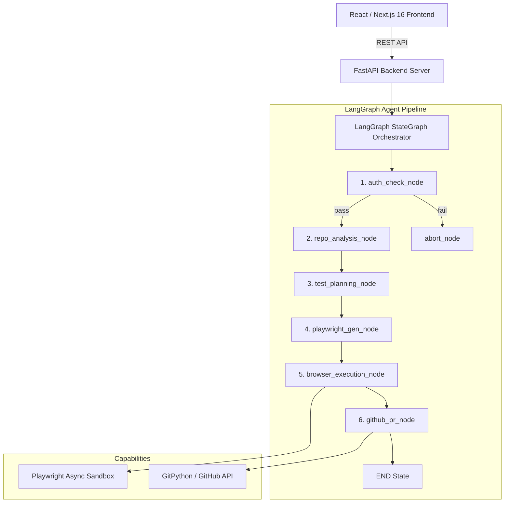

# TestPilot AI

> Autonomous, AI-native QA engineering platform powered by a **Python FastAPI + LangGraph StateGraph Agentic Engine** and a **React Dashboard**.

---

## System Architecture



---

## Clean Monorepo Structure

```
testpilot-ai/
├── apps/
│   ├── backend/                # Python FastAPI + LangGraph Backend
│   │   ├── app/
│   │   │   ├── main.py         # FastAPI REST Endpoint
│   │   │   ├── config.py       # pydantic-settings Environment Management
│   │   │   ├── models.py       # Pydantic v2 Domain Data Contracts
│   │   │   ├── graph/          # LangGraph StateGraph Orchestration
│   │   │   │   ├── state.py    # TestPilotState TypedDict
│   │   │   │   ├── nodes.py    # Agent Reasoning Nodes
│   │   │   │   ├── edges.py    # Conditional Routing Functions
│   │   │   │   ├── tools.py    # LangChain @tool Decorated Functions
│   │   │   │   └── pipeline.py # StateGraph Assembly & Async Invocation
│   │   │   ├── auth/           # Auth Subsystem (AuthManager, SessionCache)
│   │   │   └── api/            # REST API Routers
│   │   ├── tests/              # Pytest Suite
│   │   └── requirements.txt
│   └── frontend/               # Next.js 16 + Tailwind CSS Dark Obsidian Dashboard
├── docs/
│   └── architecture.md         # Full System Architecture & Data Flow
├── README.md
└── .gitignore
```

---

## Core Features

* **LangGraph `StateGraph` Orchestration**: Declarative, checkpointed agent state graph driving the full test generation pipeline.
* **Repo Analysis Agent**: Clones target repository and inspects file tree, routes, framework config, and component structure.
* **AI Test Planning**: Combines repo structure with live DOM inspection to derive resilient E2E test scenarios.
* **Playwright Test Generation**: Generates clean Playwright Python test scripts targeting discovered routes and interactive elements.
* **Automated Browser Execution**: Runs generated test suites in isolated headless Playwright browser sandboxes.
* **GitHub PR Integration**: Creates ready-to-merge Pull Requests containing generated Playwright test suites.

---

## Quick Start

### 1. Python Backend Setup

```bash
cd apps/backend

# Create & activate virtual environment
python -m venv venv
source venv/bin/activate  # On Windows: venv\Scripts\activate

# Install dependencies
pip install -r requirements.txt

# Install Playwright Chromium browser
playwright install chromium

# Start FastAPI dev server on port 3001
uvicorn app.main:app --reload --port 3001
```

### 2. Next.js Frontend Setup

```bash
cd apps/frontend

# Install & start Next.js dev server on port 3000
pnpm install
pnpm dev
```

### 3. Running Automated Pipeline Tests

```bash
cd apps/backend
$env:PYTHONPATH="."  # On Linux/macOS: export PYTHONPATH=.
pytest tests/test_graph_pipeline.py
```
