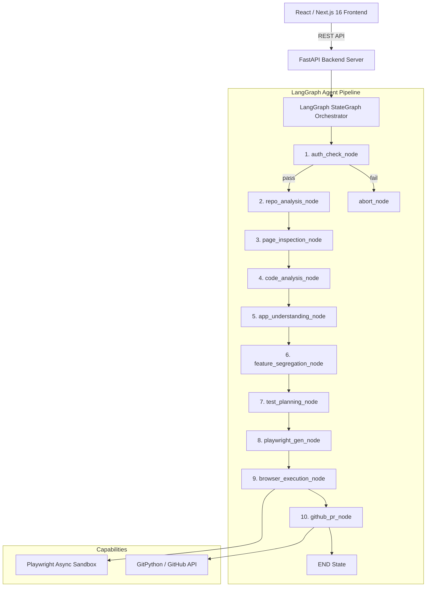

# TestPilot AI

> Autonomous, AI-native QA engineering platform powered by a **Python FastAPI + LangGraph StateGraph Agentic Engine** and a **React Dashboard**.

---

## System Architecture



---

## Clean Monorepo Structure

```
testpilot-ai/
├── apps/
│   ├── backend/                # Python FastAPI + LangGraph Backend
│   │   ├── app/
│   │   │   ├── main.py         # FastAPI REST Endpoint
│   │   │   ├── config.py       # pydantic-settings Environment Management
│   │   │   ├── models.py       # Pydantic v2 Domain Data Contracts
│   │   │   ├── graph/          # LangGraph StateGraph Orchestration
│   │   │   │   ├── state.py    # TestPilotState TypedDict
│   │   │   │   ├── nodes.py    # Agent Reasoning Nodes
│   │   │   │   ├── edges.py    # Conditional Routing Functions
│   │   │   │   ├── tools.py    # LangChain @tool Decorated Functions
│   │   │   │   ├── page_inspection_node.py # DOM elements visibility inspection
│   │   │   │   ├── code_analysis_node.py   # Code static dependencies discovery
│   │   │   │   ├── app_understanding_node.py # Inferred domain QA reasoning
│   │   │   │   ├── feature_segregation_node.py # Client-side SPA tab grouper
│   │   │   │   └── pipeline.py # StateGraph Assembly & Async Invocation
│   │   │   ├── auth/           # Auth Subsystem (AuthManager, SessionCache)
│   │   │   └── api/            # REST API Routers
│   │   ├── tests/              # Pytest Suite
│   │   └── requirements.txt
│   └── frontend/               # Next.js 16 + Tailwind CSS Dark Obsidian Dashboard
├── docs/
│   └── architecture.md         # Full System Architecture & Data Flow
├── README.md
│   └── .gitignore
```

---

## Core Features

* **LangGraph `StateGraph` Orchestration**: Checkpointed, stateful agent loop driving the automated test creation pipeline.
* **Live Page Inspection**: Scans active website DOM trees to discover visible interactive items (buttons, links, text inputs) while skipping hidden layout artifacts.
* **Code static analysis**: Checks frameworks, routing files, schema validation scripts (Zod/Yup), API requests, and custom state context logic.
* **QA Reasoning Engine**: Performs cross-validation checks between live rendering elements and code patterns to build complete business behavior profiles.
* **Client-Side SPA Tab Segregation**: Discovers non-path interactive views (tabs like Inventory, Employees, Reports, CRM) in SPA projects and maps them to feature test cases.
* **Resilient Playwright Generation**: Produces clean spec assertions using target role-based / label-based selectors instead of fragile CSS selectors.
* **Sandboxed Browser Execution**: Simulates live browser interactions and collects output execution console logs.
* **GitHub PR Integration**: Submits a ready-to-review Pull Request on completion.

---

## Quick Start

### 1. Python Backend Setup

```bash
cd apps/backend

# Create & activate virtual environment
python -m venv venv
source venv/bin/activate  # On Windows: venv\Scripts\activate

# Install dependencies
pip install -r requirements.txt

# Install Playwright Chromium browser
playwright install chromium

# Start FastAPI dev server on port 3001
uvicorn app.main:app --reload --port 3001
```

### 2. Next.js Frontend Setup

```bash
cd apps/frontend

# Install & start Next.js dev server on port 3000
pnpm install
pnpm dev
```

### 3. Running Automated Pipeline Tests

```bash
cd apps/backend
$env:PYTHONPATH="."  # On Linux/macOS: export PYTHONPATH=.
pytest tests/test_graph_pipeline.py
```
