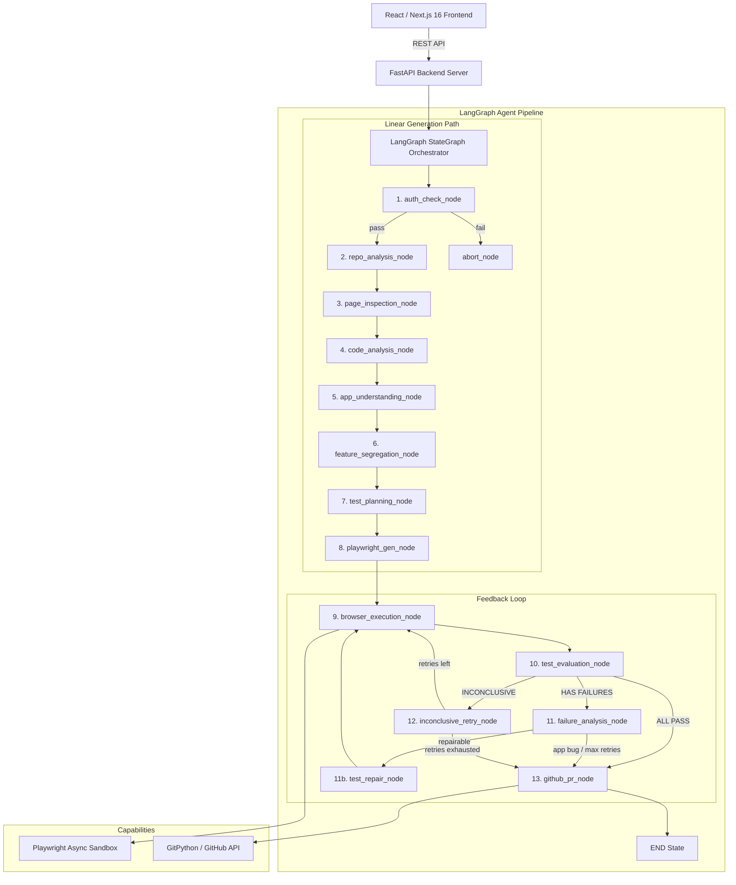

# TestPilot AI

> Autonomous, AI-native QA engineering platform powered by a **Python FastAPI + LangGraph StateGraph Agentic Engine** with **feedback-loop test repair** and a **React Dashboard**.

---

## System Architecture



---

## Clean Monorepo Structure

```
testpilot-ai/
├── apps/
│   ├── backend/                # Python FastAPI + LangGraph Backend
│   │   ├── app/
│   │   │   ├── main.py         # FastAPI REST Endpoint
│   │   │   ├── config.py       # pydantic-settings Environment Management
│   │   │   ├── models.py       # Pydantic v2 Domain Data Contracts
│   │   │   ├── graph/          # LangGraph StateGraph Orchestration
│   │   │   │   ├── state.py    # TestPilotState TypedDict + merge reducers
│   │   │   │   ├── nodes.py    # Core Agent Nodes (auth, repo, exec, PR)
│   │   │   │   ├── edges.py    # Conditional Routing Functions
│   │   │   │   ├── tools.py    # LangChain @tool Decorated Functions
│   │   │   │   ├── pipeline.py # StateGraph Assembly & Async Invocation
│   │   │   │   ├── page_inspection_node.py    # DOM + Accessibility Tree extraction
│   │   │   │   ├── code_analysis_node.py      # Static code analysis
│   │   │   │   ├── app_understanding_node.py  # LLM domain reasoning
│   │   │   │   ├── feature_segregation_node.py # SPA feature grouping
│   │   │   │   ├── test_evaluation_node.py    # Deterministic test evaluation
│   │   │   │   ├── failure_analysis_node.py   # LLM root cause classification
│   │   │   │   ├── test_repair_node.py        # LLM test repair (max 3 attempts)
│   │   │   │   └── inconclusive_retry_node.py # Deterministic env flake retry
│   │   │   ├── auth/           # Auth Subsystem (AuthManager, SessionCache)
│   │   │   └── api/            # REST API Routers
│   │   ├── tests/              # Pytest Suite
│   │   └── requirements.txt
│   └── frontend/               # Next.js 16 + Tailwind CSS Dark Obsidian Dashboard
├── docs/
│   └── architecture.md         # Full System Architecture & Data Flow
├── README.md
│   └── .gitignore
```

---

## Core Features

* **LangGraph `StateGraph` Orchestration**: Checkpointed, stateful agent pipeline with feedback loops for test repair and retry.
* **Feedback-Loop Test Repair**: Failed tests are evaluated, classified by root cause (selector wrong, timing issue, test assumption wrong, or application bug), and automatically repaired up to 3 times.
* **Application Bug Detection**: Tests classified as application bugs are documented in the PR body with evidence — the system never weakens assertions to mask real defects.
* **Deterministic Environment Retry**: Inconclusive tests (DNS, timeout, service down) are retried without LLM invocation, saving tokens and eliminating hallucination.
* **Custom Merge Reducers**: Per-test state fields use `Annotated` types with `merge_dicts` reducers to prevent LangGraph's last-write-wins from corrupting data during repair loops.
* **Scoped Re-execution**: During repair cycles, only repaired tests are re-run — passing tests are preserved via the merge reducer.
* **Live Page Inspection**: Scans active website DOM trees and extracts the Playwright Accessibility Tree (AOM) for semantic element discovery.
* **Code Static Analysis**: Analyzes frameworks, routing files, schema validation, API requests, and state management patterns.
* **QA Reasoning Engine**: Cross-validates live DOM elements against code patterns to build business behavior profiles.
* **Resilient Playwright Generation**: Produces clean assertions using role-based / label-based selectors instead of fragile CSS selectors.
* **Sandboxed Browser Execution**: Runs tests in isolated Chromium contexts with full log capture.
* **GitHub PR Integration**: Submits PRs with test results summary, auto-repair report, and suspected application bug documentation.

---

## Quick Start

### 1. Python Backend Setup

```bash
cd apps/backend

# Create & activate virtual environment
python -m venv venv
source venv/bin/activate  # On Windows: venv\Scripts\activate

# Install dependencies
pip install -r requirements.txt

# Install Playwright Chromium browser
playwright install chromium

# Start FastAPI dev server on port 3001
uvicorn app.main:app --reload --port 3001
```

### 2. Next.js Frontend Setup

```bash
cd apps/frontend

# Install & start Next.js dev server on port 3000
pnpm install
pnpm dev
```

### 3. Running Automated Pipeline Tests

```bash
cd apps/backend
$env:PYTHONPATH="."  # On Linux/macOS: export PYTHONPATH=.
pytest tests/test_graph_pipeline.py
```
