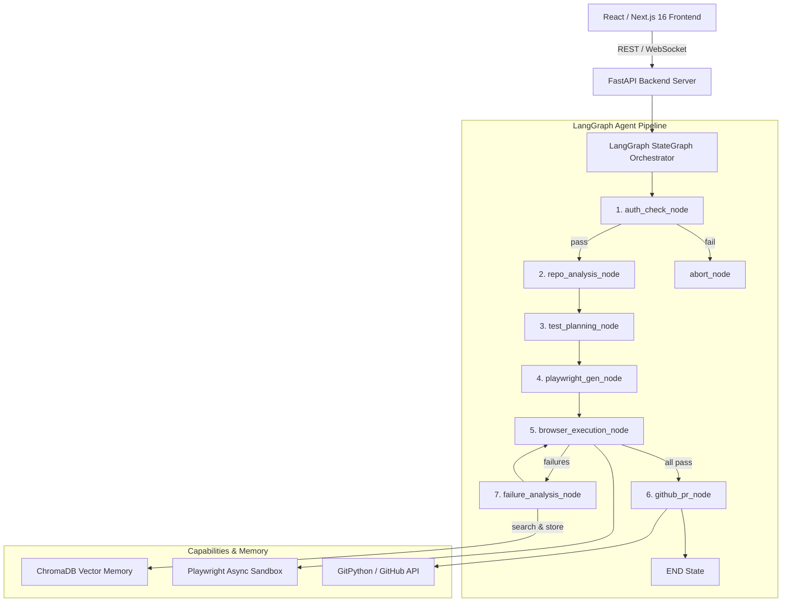

# TestPilot AI

> Autonomous, AI-native QA engineering platform powered by a **Python FastAPI + LangGraph StateGraph Agentic Engine** and a **React / Next.js 16 Dark-Mode Dashboard**.

---

## System Architecture



---

## Clean Monorepo Structure

```
testpilot-ai/
├── apps/
│   ├── backend/                # Python 3.12 FastAPI + LangGraph Backend
│   │   ├── app/
│   │   │   ├── main.py         # FastAPI REST & WebSocket Endpoint
│   │   │   ├── config.py       # pydantic-settings Environment Management
│   │   │   ├── models.py       # Pydantic v2 Domain Data Contracts
│   │   │   ├── graph/          # LangGraph StateGraph Orchestration
│   │   │   │   ├── state.py    # TestPilotState TypedDict
│   │   │   │   ├── nodes.py    # Multi-step Agent Reasoning Nodes
│   │   │   │   ├── edges.py    # Conditional Routing Functions
│   │   │   │   ├── tools.py    # LangChain @tool Decorated Functions
│   │   │   │   └── pipeline.py # StateGraph Assembly & Async Invocation
│   │   │   ├── memory/         # Persistent Cross-Run Agent Memory (ChromaDB)
│   │   │   ├── auth/           # Enterprise Auth Subsystem (AuthManager, SessionCache)
│   │   │   ├── core/           # WebSocket Manager & Telemetry
│   │   │   ├── tools/          # Physical Tool Execution Registry
│   │   │   └── api/            # REST API Routers
│   │   ├── tests/              # Pytest Suite
│   │   └── requirements.txt
│   └── frontend/               # Next.js 16 + Tailwind CSS Dark Obsidian Dashboard
├── docs/
│   ├── architecture.md         # Full System Architecture & Data Flow
│   └── interview.md            # Enterprise System Design & Interview Guide
├── Dockerfile.backend
├── Dockerfile.frontend
├── docker-compose.yml
├── render.yaml
└── README.md
```

---

## Core Features & Agentic Highlights

* **LangGraph `StateGraph` Orchestration**: Replaces hand-rolled event buses with a declarative, checkpointed agent state graph.
* **Multi-Step Self-Healing Loop**: If locator drift or test failures occur during browser execution, the `failure_analysis` node automatically inspects live DOM state, repairs selectors, and re-executes tests.
* **Persistent Cross-Run Vector Memory**: Powered by **ChromaDB**. Learns from previous selector failures and app quirks so subsequent runs execute faster with zero retries.
* **Fail-Fast Post-Authentication Probe**: Pre-authenticates sessions using `AuthManager` with heuristic-first DOM scanning before executing tests, avoiding cascading failures on bad credentials.
* **Realtime WebSocket Streaming**: Live broadcasts agent reasoning steps and node transitions directly to the Next.js workspace dashboard.
* **Auto-Generated GitHub Pull Requests**: Creates ready-to-merge PRs containing generated and self-healed Playwright test suites.

---

## Quick Start

### 1. Python Backend Setup

```bash
cd apps/backend

# Create & activate virtual environment
python -m venv venv
source venv/bin/activate  # On Windows: venv\Scripts\activate

# Install dependencies
pip install -r requirements.txt

# Install Playwright Chromium browser
playwright install chromium

# Start FastAPI dev server on port 3001
uvicorn app.main:app --reload --port 3001
```

### 2. Next.js Frontend Setup

```bash
cd apps/frontend

# Install & start Next.js dev server on port 3000
pnpm install
pnpm dev
```

### 3. Running Automated Pipeline Tests

```bash
cd apps/backend
$env:PYTHONPATH="."  # On Linux/macOS: export PYTHONPATH=.
pytest tests/test_graph_pipeline.py
```
