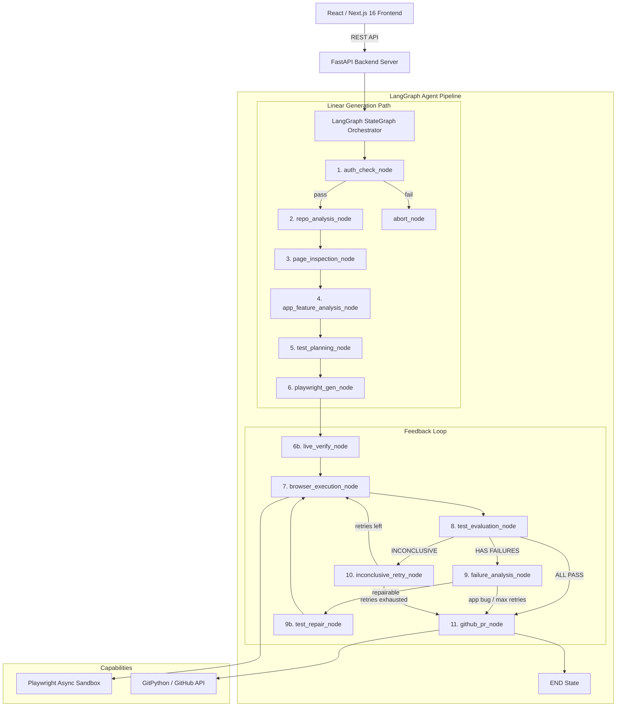

# Verity

> Agentic Test Engineering Platform powered by a **Python FastAPI + LangGraph StateGraph Agentic Engine** with **feedback-loop test repair** and a **React Dashboard**.

---

## System Architecture


```mermaid
flowchart TD
    FE["React / Next.js 16 Frontend"] -->|REST API| API["FastAPI Backend Server"]
    API --> GRAPH["LangGraph StateGraph Orchestrator"]

    subgraph Pipeline["LangGraph Agent Pipeline"]
        direction TB
        subgraph Linear["Linear Generation Path"]
            GRAPH --> AUTH["1. auth_check_node"]
            AUTH -->|pass| REPO["2. repo_analysis_node"]
            AUTH -->|fail| ABORT["abort_node"]
            REPO --> INSP["3. page_inspection_node"]
            INSP --> AF["4. app_feature_analysis_node"]
            AF --> PLAN["5. test_planning_node"]
            PLAN --> GEN["6. playwright_gen_node"]
        end

        subgraph Feedback["Feedback Loop"]
            GEN --> LV["6b. live_verify_node"]
            LV --> EXEC["7. browser_execution_node"]
            EXEC --> EVAL["8. test_evaluation_node"]
            EVAL -->|ALL PASS| PR["11. github_pr_node"]
            EVAL -->|HAS FAILURES| FAIL_A["9. failure_analysis_node"]
            EVAL -->|INCONCLUSIVE| INCONC["10. inconclusive_retry_node"]
            FAIL_A -->|repairable| REPAIR["9b. test_repair_node"]
            FAIL_A -->|app bug / max retries| PR
            REPAIR --> EXEC
            INCONC -->|retries left| EXEC
            INCONC -->|retries exhausted| PR
        end

        PR --> DONE["END State"]
    end

    subgraph Capabilities["Capabilities"]
        EXEC --> PW["Playwright Async Sandbox"]
        PR --> GIT["GitPython / GitHub API"]
    end
```

---

## Clean Monorepo Structure

```
testpilot-ai/
├── apps/
│   ├── backend/                # Python FastAPI + LangGraph Backend
│   │   ├── app/
│   │   │   ├── main.py         # FastAPI REST Endpoint
│   │   │   ├── config.py       # Backward-compatible shim -> app/core/config.py
│   │   │   ├── db.py           # Backward-compatible shim -> app/repositories/database.py
│   │   │   ├── llm.py          # Backward-compatible shim -> app/services/llm/
│   │   │   ├── models.py       # Pydantic v2 Domain Data Contracts
│   │   │   ├── core/           # Centralized Settings, logging, shared Singleton base
│   │   │   ├── services/llm/   # LLM provider abstraction + registry + factory + facade
│   │   │   ├── repositories/   # SQLite Database repository abstraction
│   │   │   ├── graph/          # LangGraph StateGraph Orchestration
│   │   │   │   ├── state.py    # TestPilotState TypedDict + merge reducers
│   │   │   │   ├── nodes.py    # Core Agent Nodes (planning, codegen, exec, PR)
│   │   │   │   ├── playwright_runner.py # ProactorEventLoop thread isolation
│   │   │   │   ├── edges.py    # Conditional Routing Functions
│   │   │   │   ├── tools.py    # LangChain @tool Decorated Functions
│   │   │   │   ├── pipeline.py # StateGraph Assembly & Async Invocation
│   │   │   │   ├── page_inspection_node.py    # DOM + Accessibility Tree extraction
│   │   │   │   ├── app_feature_analysis_node.py # LLM app reasoning + SPA feature grouping
│   │   │   │   ├── live_verify_node.py        # Pre-execution live DOM selector validation
│   │   │   │   ├── test_evaluation_node.py    # Deterministic test evaluation
│   │   │   │   ├── failure_analysis_node.py   # LLM root cause classification
│   │   │   │   ├── test_repair_node.py        # LLM test repair (max 3 attempts)
│   │   │   │   └── inconclusive_retry_node.py # Deterministic env flake retry
│   │   │   ├── auth/           # Auth Subsystem (AuthManager, SessionCache)
│   │   │   └── api/            # REST API Routers
│   │   ├── tests/              # Pytest Suite
│   │   └── requirements.txt
│   └── frontend/               # Next.js 16 + Tailwind CSS Dark Obsidian Dashboard
├── README.md
└── .gitignore
```

---

## Core Features

* **LangGraph `StateGraph` Orchestration**: Checkpointed, stateful agent pipeline with feedback loops for test repair and retry.
* **LLM Natural Language Test Planning**: Expert QA planning agent analyzes discovered application context to produce comprehensive test plans (happy paths, validations, negative scenarios, boundary conditions, edge cases) with priority ratings (`critical`, `high`, `medium`).
* **AOM-Grounded Playwright Code Generation**: Translates natural-language plans into concrete, structured JSON execution steps and clean Python Playwright suites grounded in live Accessibility Trees (AOM / `aria_snapshot`) and DOM elements.
* **Live Verify**: Deterministic pre-execution gate (`live_verify_node`) that validates every generated selector (click / fill / assert targets) against the ground-truth live DOM captured during page inspection. Hallucinated selectors are auto-corrected via fuzzy matching to the closest real element; unconfirmable selectors are flagged for runtime triage — the pipeline never executes against unproven selectors silently.
* **ProactorEventLoop Thread Isolation**: Dedicated `playwright_runner` executes browser automation in a separate Proactor thread, preventing event loop subprocess conflicts with Uvicorn on Windows.
* **Feedback-Loop Test Repair**: Failed tests are evaluated, classified by root cause (selector wrong, timing issue, test assumption wrong, or application bug), and automatically repaired up to 3 times with structured step updates.
* **Application Bug Detection**: Tests classified as application bugs are documented in the PR body with evidence — the system never weakens assertions to mask real defects.
* **Deterministic Environment Retry**: Inconclusive tests (DNS, timeout, service down) are retried without LLM invocation, saving tokens and eliminating hallucination.
* **Custom Merge Reducers**: Per-test state fields use `Annotated` types with `merge_dicts` reducers to prevent LangGraph's last-write-wins from corrupting data during repair loops.
* **Scoped Re-execution**: During repair cycles, only repaired tests are re-run — passing tests are preserved via the merge reducer.
* **Live Page Inspection**: Scans active website DOM trees and extracts the Playwright Accessibility Tree (AOM) for semantic element discovery.
* **Application Understanding & Feature Mapping**: A single LLM pass (`app_feature_analysis_node`) reasons about the application (name, type, purpose, user flows, testable features, critical paths, risks) and simultaneously groups discovered pages into testable feature areas mapped to concrete DOM elements — with a deterministic rule-based fallback.
* **Durable SQLite Persistence**: All projects, test runs, and test cases are persisted to a local SQLite database (`app/db.py`) — state survives backend restarts and duplicate server instances. Project deletion cascades to runs and test cases.
* **Run Lifecycle Controls**: Cancel in-flight pipeline runs via `POST /api/test-runs/run/{id}/cancel` (graceful asyncio task cancellation with terminal-state reconciliation for stale runs) or delete them; both exposed in the dashboard.
* **Centralized, Provider-Agnostic LLM Service**: All pipeline nodes call a single `LLMService` facade (`app/services/llm/`). Providers (AWS **Bedrock**, OpenRouter, Groq) are registered behind a common interface and selected purely by configuration (`LLM_PROVIDER`) — no node constructs a provider directly and no JSON parsing/fallback is duplicated. Bedrock authenticates via the boto3 provider chain (EC2 IAM role), never hard-coded keys.
* **GitHub PR Integration**: Submits PRs with test results summary, auto-repair report, and suspected application bug documentation.

### Future Work

* **AST-Based Static Analysis**: The former `code_analysis_node` produced only superficial
  library-usage flags (framework / auth provider / schema validation / state hooks) and performed a
  partially dead read (it never set the `components` key the planner looked for), so it was removed.
  The actionable signals — routes and concrete DOM elements — already come from `repo_analysis` +
  `page_inspection`. If deeper source-level insight is needed later, it should be reintroduced as an
  **AST-based** pass (Python `ast` / a TS/JS parser) extracting real component trees, imports, and
  API call sites to enrich the `app_feature_analysis` evidence, rather than the previous
  string/regex heuristics. It is intentionally **not** added now.

---

## Quick Start

### 1. Python Backend Setup

```bash
cd apps/backend

# Create & activate virtual environment
python -m venv venv
source venv/bin/activate  # On Windows: venv\Scripts\activate

# Install dependencies
pip install -r requirements.txt

# Install Playwright Chromium browser
playwright install chromium

# Start FastAPI dev server on port 3001
uvicorn app.main:app --reload --port 3001
```

### 2. Next.js Frontend Setup

```bash
cd apps/frontend

# Install & start Next.js dev server on port 3000
pnpm install
pnpm dev
```

### 3. Running Automated Pipeline Tests

```bash
cd apps/backend
$env:PYTHONPATH="."  # On Linux/macOS: export PYTHONPATH=.
pytest tests/test_graph_pipeline.py
```

---

## Docker & EC2 Deployment

The backend ships as a Playwright-based Docker image (`Dockerfile.backend`) that
runs as a non-root user, exposes port `3001`, has a `/api/health` healthcheck,
and persists SQLite/artifacts/repos on volumes.

```bash
# Local: build + run backend (SQLite on named volumes)
docker compose up -d --build
curl http://localhost:3001/api/health

# EC2 (repeatable deploy: build -> replace container -> health check)
./deploy/deploy.sh
```

For the full AWS setup — IAM instance role for Bedrock, SSM Session Manager
access, Docker install, environment configuration, persistent directories,
upgrades and troubleshooting — see **[`deploy/EC2.md`](deploy/EC2.md)**.

> Configuration is environment-driven: `LLM_PROVIDER=bedrock` + `AWS_REGION` +
> `BEDROCK_MODEL_ID` on EC2 (credentials from the IAM role), or
> `LLM_PROVIDER=openrouter`/`groq` for local development. Copy `.env.example`
> to `.env` and fill in placeholders — never commit real secrets.

