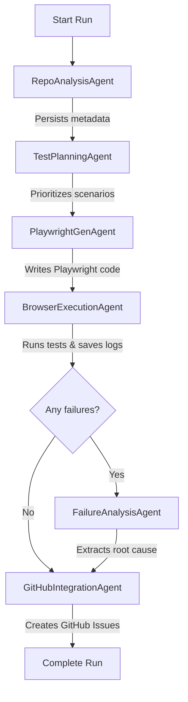
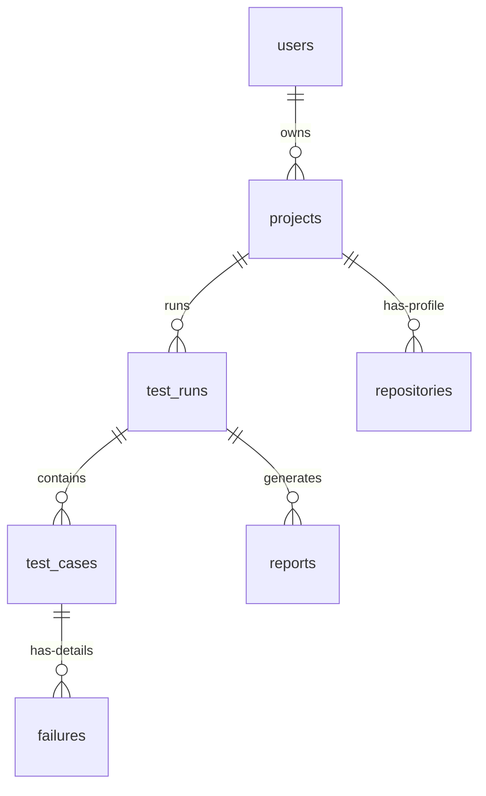

# TestPilot AI — System Architecture

This document describes the architectural design, directory structure, data models, and agent execution pipeline of TestPilot AI. It is intended for co-developers to understand the subsystems, data flows, and design choices.

---

## 1. System Overview & Monorepo Structure

TestPilot AI is structured as a TypeScript monorepo managed via `pnpm` workspaces. It consists of two application entry points (`apps/`) and a set of shared, decoupled packages (`packages/`) to isolate concerns.

```
testpilot-ai/
├── apps/
│   ├── backend/            # Express API + WebSocket server (broadcasting job progress)
│   └── frontend/           # Next.js 15 dashboard (visualizing runs, logs, and failure analysis)
├── packages/
│   ├── agents/             # Core multi-agent pipeline orchestrator
│   ├── database/           # Drizzle ORM + PostgreSQL client & schemas
│   ├── playwright-engine/  # Isolated browser management & test execution
│   ├── github-engine/      # Repository cloning and Octokit-based sync (GitHub Issues)
│   ├── prompt-engine/      # LLM clients, template management, & connection-resilient caching
│   ├── queue/              # BullMQ queue & worker abstractions backed by Redis
│   ├── shared/             # General utilities, custom logger, cryptographic helpers, custom errors
│   └── types/              # Unified TypeScript definitions & Zod runtime validation schemas
```

---

## 2. Multi-Agent Pipeline & The Orchestrator

The system relies on an event-driven orchestrator (`Orchestrator` inside `packages/agents`) that drives a sequential multi-agent execution pipeline. When a test run is started, the Orchestrator initiates each agent in turn, passing the accumulating `AgentContext` and persisting statuses to the database.



### Agent Roles

1. **`RepoAnalysisAgent`**: Clones/pulls the target project's Git repository. Detects frameworks, entry points, dependencies, routes, and APIs to build a project profile.
2. **`TestPlanningAgent`**: Uses Groq LLM (Llama 3.3 70B) to analyze the project profile and generate logical E2E test scenarios.
3. **`PlaywrightGenAgent`**: Translates the logical test scenarios into runnable Playwright test code blocks.
4. **`BrowserExecutionAgent`**: Spawns headless browser pages, executes the dynamically generated Playwright test code inside custom-sandboxed contexts, and saves trace files, screenshots, and logs.
5. **`FailureAnalysisAgent`**: If any test cases fail, it extracts the console logs, trace files, and DOM snapshots to perform root-cause analysis and suggest code-level fixes.
6. **`GitHubIntegrationAgent`**: Synchronizes execution results to the target repository (creating detailed GitHub Issues for any failures).

---

## 3. Database Schema & Data Persistence

The data persistence layer is handled by **PostgreSQL** using the **Drizzle ORM** (defined in `packages/database/src/schema.ts`).

### Schema Entities



* **`users`**: User account credentials, encrypted GitHub access tokens, and profile data.
* **`projects`**: Configured repositories and target `websiteUrl`s to run tests against.
* **`repositories`**: The repository profile detected during the `RepoAnalysis` step (entry points, framework, routes, dependencies).
* **`test_runs`**: The lifecycle record of a test execution suite. Tracks statuses: `pending` → `analyzing` → `planning` → `generating` → `executing` → `analyzing_failures` → `reporting` → `completed` / `failed`.
* **`test_cases`**: Individual Playwright test codes, execution logs, screenshot paths, trace paths, and durations.
* **`failures`**: Failure classification (`assertion`, `timeout`, `selector`, `network`, `script`), message, stack trace, root cause analysis, suggested fix, and DOM snapshots.

---

## 4. Real-time Status Syncing (WebSockets & REST)

* **Triggering Runs**: When a user starts a run manually (via the frontend UI), the frontend calls `POST /api/test-runs/:projectId/start`. The backend starts the pipeline asynchronously and returns a `202 Accepted` status with a `runId`.
* **Progress Updates**: As the Orchestrator runs, it emits status and progress events (`status` and `event` events). The Express-WebSocket server (`apps/backend/src/ws/handler.ts`) broadcasts these events to all clients subscribed to that project's channel.
* **Database Coherency**: All status transitions (`planning`, `executing`, etc.) are written sequentially to the database, ensuring that if a user reloads the dashboard, the state matches perfectly.

---

## 5. Key Reliability Safeguards & Design Decisions

### 1. Robust E2E Code Parsing
Playwright code written by LLMs often includes trailing config parameters, imports, or comments (e.g. `, { timeout: 30000 });`). Rather than using fragile regular expressions, the runner uses a stateful brace-matching scanner (`createTestFunction` in `packages/playwright-engine`) to extract the exact function body, preventing `SyntaxError: Unexpected token ')'` during evaluation.

### 2. Sandbox Expect Mocks
Because the extracted test code executes dynamically inside an evaluated context (`new Function("page", "expect", ...)`), standard Playwright `expect` assertions (which are async and chainable) are mocked inside the runner. The custom mock supports:
- `toBeVisible()`
- `toHaveTitle(expected)`
- `toHaveURL(expected)`
- `toContainText(expected)`
- `toHaveCount(expected)`
- `toBeDisabled()` / `toBeEnabled()`

This prevents `TypeError: expect(...).toHaveTitle is not a function` and translates Playwright assertions into clean, caught exceptions for the failure analyzer.

### 3. Redis Connection Resilience
To support development environments running without Redis, the `ioredis` client in `packages/prompt-engine` has a suppressed error listener (`.on("error")`). This prevents unhandled connection errors from crashing the main Node.js process and falls back gracefully to a non-cached completion mode.

### 4. Git Terminal Non-Blocking
To prevent SimpleGit from opening interactive CLI prompts for usernames or passwords on invalid/expired tokens, all Git processes run with `process.env.GIT_TERMINAL_PROMPT = "0"`. This guarantees failed checkouts fail immediately instead of hanging backend workers.
