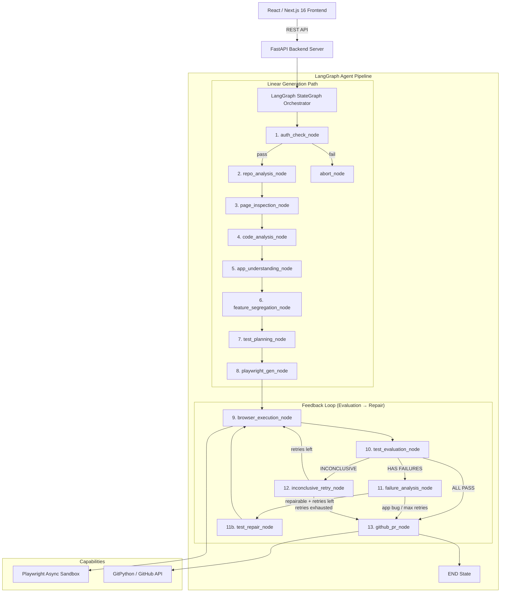

# TestPilot AI — System Architecture

This document describes the architectural design, directory structure, and agent execution pipeline of TestPilot AI.

---

## 1. System Overview & Monorepo Structure

TestPilot AI is built with a **Python FastAPI + LangGraph Agentic Backend** (`apps/backend`) and a **React / Next.js 16 Dark Obsidian IDE Dashboard** (`apps/frontend`).

```
testpilot-ai/
├── apps/
│   ├── backend/                # Python FastAPI + LangGraph Backend
│   │   ├── app/
│   │   │   ├── main.py         # FastAPI Entry Point (REST API)
│   │   │   ├── config.py       # pydantic-settings Configuration
│   │   │   ├── models.py       # Pydantic v2 Domain Schemas & Contracts
│   │   │   ├── graph/          # LangGraph StateGraph Agent Engine
│   │   │   │   ├── state.py    # TestPilotState TypedDict + merge reducers
│   │   │   │   ├── nodes.py    # Core Agent Nodes (auth, repo, exec, PR)
│   │   │   │   ├── edges.py    # Conditional Routing Functions
│   │   │   │   ├── tools.py    # LangChain @tool Functions
│   │   │   │   ├── pipeline.py # StateGraph Assembly & Async Executor
│   │   │   │   ├── page_inspection_node.py    # Playwright DOM + AOM extraction
│   │   │   │   ├── code_analysis_node.py      # Static code analysis
│   │   │   │   ├── app_understanding_node.py  # LLM app comprehension
│   │   │   │   ├── feature_segregation_node.py # LLM feature mapping
│   │   │   │   ├── test_evaluation_node.py    # Deterministic test evaluation
│   │   │   │   ├── failure_analysis_node.py   # LLM root cause classification
│   │   │   │   ├── test_repair_node.py        # LLM test repair
│   │   │   │   └── inconclusive_retry_node.py # Deterministic env flake retry
│   │   │   ├── auth/           # Authentication Subsystem
│   │   │   └── api/            # REST API Routers
│   │   ├── tests/              # Pytest Test Suites
│   │   └── requirements.txt
│   └── frontend/               # Next.js 16 Dashboard UI
```

---

## 2. Agent Pipeline — LangGraph `StateGraph`

The pipeline is modeled as a **LangGraph `StateGraph`** with feedback loops. Shared state (`TestPilotState`) flows through nodes, with conditional edges managing branching after auth and cyclical routing through the evaluation-repair loop.



### Node Classification (Deterministic vs. LLM)

| Node | Type | Role |
|------|------|------|
| `auth_check_node` | Deterministic | Pre-authenticates sessions with fail-fast verification |
| `repo_analysis_node` | Deterministic | Clones repo, parses routes, framework config |
| `page_inspection_node` | Deterministic (Playwright) | Extracts DOM elements + Accessibility Tree (AOM) |
| `code_analysis_node` | Deterministic (static) | Scans source for auth, validation, API patterns |
| `app_understanding_node` | **LLM** | Reasons about app purpose, user flows, and testable features |
| `feature_segregation_node` | **LLM** | Maps features to routes with concrete action hints |
| `test_planning_node` | **LLM** | Generates natural language test plan with coverage priorities |
| `playwright_gen_node` | **LLM** | Grounds natural language steps against AOM to generate execution steps & code |
| `browser_execution_node` | Deterministic (Playwright) | Executes structured steps in isolated Chromium sandbox via `playwright_runner` |
| `test_evaluation_node` | Deterministic + LLM fallback | Classifies results as PASS/FAIL/INCONCLUSIVE |
| `failure_analysis_node` | **LLM** | Root cause: test defect vs. application bug |
| `test_repair_node` | **LLM** | Repairs broken test steps with bounded retries |
| `inconclusive_retry_node` | Deterministic | Re-executes env-flaky tests without LLM |
| `github_pr_node` | Deterministic | Opens PRs with test suite + bug documentation |
| `abort_node` | Deterministic | Handles fail-fast terminations |

### Key Design Decisions

- **Two-tier LLM Test Generation**: Separation of *what to test* (`test_planning_node` natural language planning) and *how to test* (`playwright_gen_node` AOM-grounded selector translation).
- **ProactorEventLoop Thread Isolation**: `playwright_runner` delegates browser execution to a dedicated Proactor thread on Windows to avoid Uvicorn's event loop subprocess limitations.
- **Custom merge reducers**: Per-test state fields use `Annotated[Dict, merge_dicts]` to prevent LangGraph's last-write-wins from destroying data during repair loops.
- **Scoped re-execution**: `tests_to_execute` limits which tests run during repair cycles, avoiding full-suite reruns.
- **Bounded repair loops**: `MAX_REPAIR_ATTEMPTS = 3` per test prevents unbounded LLM retry loops.
- **Recursion limit**: Graph runs with `recursion_limit=150` to accommodate nested repair cycles.
- **Frontend backward compatibility**: All feedback loop nodes map to `"executing"` status for the frontend polling contract.

---

## 3. REST API & Frontend Integration

* **Triggering Runs**: The frontend sends `POST /api/test-runs/:projectId/start`. The backend spawns `run_pipeline` asynchronously.
* **Polling Status**: The frontend polls `GET /api/test-runs/:projectId` and `GET /api/test-runs/run/:runId` for status updates.
* **Project Management**: `GET/POST/PATCH/DELETE /api/projects` for workspace CRUD and credential storage.
