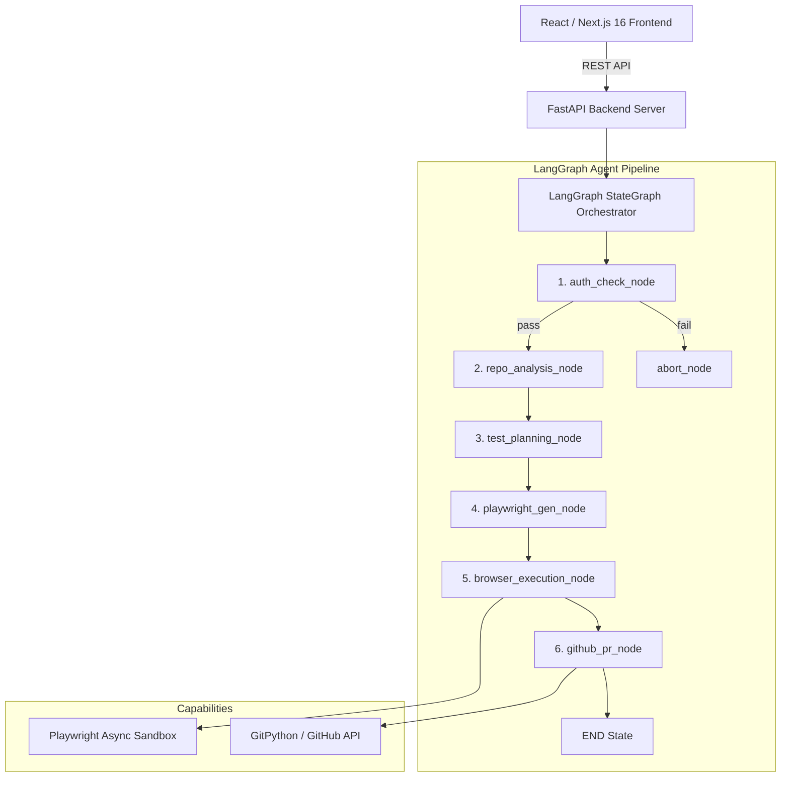

# TestPilot AI — System Architecture

This document describes the architectural design, directory structure, and agent execution pipeline of TestPilot AI.

---

## 1. System Overview & Monorepo Structure

TestPilot AI is built with a **Python FastAPI + LangGraph Agentic Backend** (`apps/backend`) and a **React / Next.js 16 Dark Obsidian IDE Dashboard** (`apps/frontend`).

```
testpilot-ai/
├── apps/
│   ├── backend/                # Python FastAPI + LangGraph Backend
│   │   ├── app/
│   │   │   ├── main.py         # FastAPI Entry Point (REST API)
│   │   │   ├── config.py       # pydantic-settings Configuration
│   │   │   ├── models.py       # Pydantic v2 Domain Schemas & Contracts
│   │   │   ├── graph/          # LangGraph StateGraph Agent Engine
│   │   │   │   ├── state.py    # TestPilotState TypedDict
│   │   │   │   ├── nodes.py    # Agent Reasoning Nodes
│   │   │   │   ├── edges.py    # Conditional Routing Functions
│   │   │   │   ├── tools.py    # LangChain @tool Functions
│   │   │   │   └── pipeline.py # StateGraph Assembly & Async Executor
│   │   │   ├── auth/           # Authentication Subsystem
│   │   │   └── api/            # REST API Routers
│   │   ├── tests/              # Pytest Test Suites
│   │   └── requirements.txt
│   └── frontend/               # Next.js 16 Dashboard UI
```

---

## 2. Agent Pipeline — LangGraph `StateGraph`

The pipeline is modeled as a **LangGraph `StateGraph`**. Shared state (`TestPilotState`) flows through nodes sequentially, with a conditional edge managing fail-fast branching after auth.



### Agent Node Roles

1. **`auth_check_node`**: Pre-authenticates sessions using `AuthManager` with fail-fast verification before test execution begins.
2. **`repo_analysis_node`**: Analyzes repository structure, routes, entry points, and framework configuration.
3. **`test_planning_node`**: Combines repo structure and live DOM interactive element scans to plan E2E scenarios.
4. **`playwright_gen_node`**: Generates clean Playwright Python test scripts.
5. **`browser_execution_node`**: Executes test suites using `playwright.async_api` in isolated browser sandboxes.
6. **`github_pr_node`**: Opens GitHub Pull Requests containing generated test suites.
7. **`abort_node`**: Handles fail-fast terminations with clear error messages.

---

## 3. REST API & Frontend Integration

* **Triggering Runs**: The frontend sends `POST /api/test-runs/:projectId/start`. The backend spawns `run_pipeline` asynchronously.
* **Polling Status**: The frontend polls `GET /api/test-runs/:projectId` and `GET /api/test-runs/run/:runId` for status updates.
* **Project Management**: `GET/POST/PATCH/DELETE /api/projects` for workspace CRUD and credential storage.
