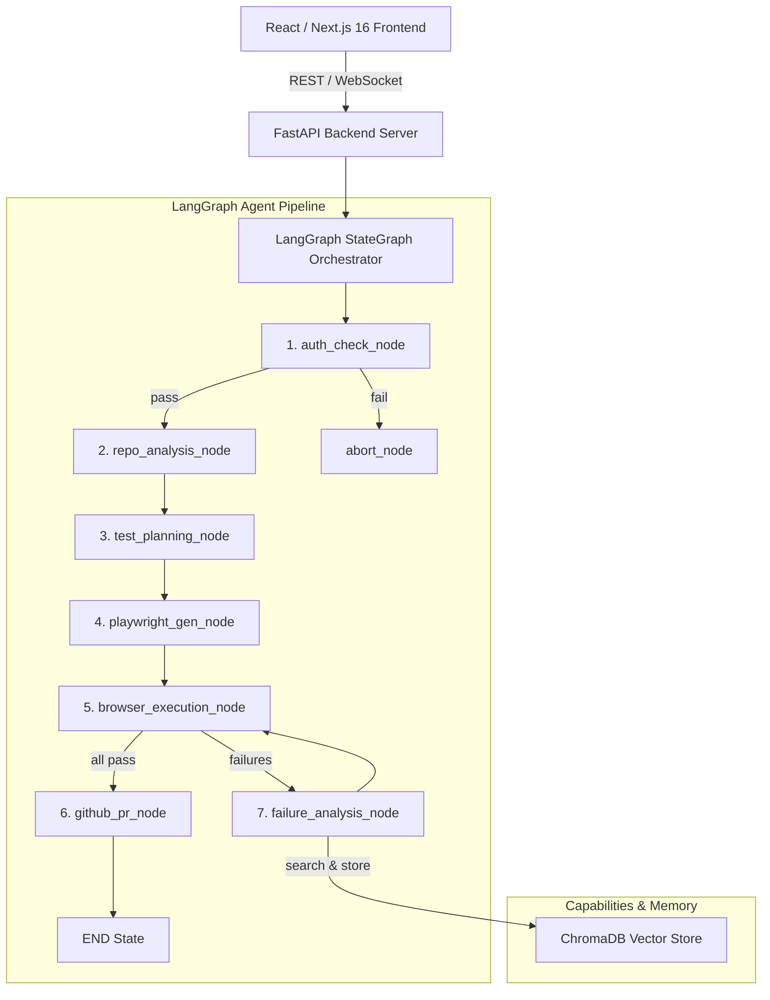

# TestPilot AI — System Architecture

This document describes the architectural design, directory structure, data models, and agent execution pipeline of TestPilot AI.

---

## 1. System Overview & Monorepo Structure

TestPilot AI is built with a **Python FastAPI + LangGraph Agentic Backend** (`apps/backend`) and a **React / Next.js 16 Dark Obsidian IDE Dashboard** (`apps/frontend`).

```
testpilot-ai/
├── apps/
│   ├── backend/                # Python 3.12 FastAPI + LangGraph Backend
│   │   ├── app/
│   │   │   ├── main.py         # FastAPI Entry Point (REST + WebSockets)
│   │   │   ├── config.py       # pydantic-settings Configuration
│   │   │   ├── models.py       # Pydantic v2 Domain Schemas & Contracts
│   │   │   ├── graph/          # LangGraph StateGraph Agent Engine
│   │   │   │   ├── state.py    # TestPilotState TypedDict
│   │   │   │   ├── nodes.py    # Multi-step Agent Reasoning Nodes
│   │   │   │   ├── edges.py    # Conditional Routing Functions
│   │   │   │   ├── tools.py    # LangChain @tool Functions
│   │   │   │   └── pipeline.py # StateGraph Assembly & Async Executor
│   │   │   ├── memory/         # ChromaDB Vector Store Persistence
│   │   │   ├── auth/           # Enterprise Authentication Subsystem
│   │   │   ├── core/           # ConnectionManager WS Streaming & APM
│   │   │   ├── tools/          # Physical Tool Handlers & Registry
│   │   │   └── api/            # REST API Routers
│   │   ├── tests/              # Pytest Test Suites
│   │   └── requirements.txt
│   └── frontend/               # Next.js 16 Dashboard UI
```

---

## 2. Multi-Agent Pipeline & LangGraph `StateGraph`

The pipeline is modeled as a **LangGraph `StateGraph`**. Shared state (`TestPilotState`) flows through nodes sequentially, with conditional edges managing fail-fast branching and self-healing retry loops.



### Agent Node Roles

1. **`auth_check_node`**: Pre-authenticates sessions using `AuthManager` (heuristic DOM scanning) with fail-fast verification before test execution begins.
2. **`repo_analysis_node`**: Analyzes repository structure, routes, entry points, and framework configuration.
3. **`test_planning_node`**: Combines repo structure and live DOM interactive node scans to plan resilient E2E scenarios.
4. **`playwright_gen_node`**: Generates clean Playwright Python test scripts.
5. **`browser_execution_node`**: Executes test suites using `playwright.async_api` in isolated browser sandboxes.
6. **`failure_analysis_node`**: When locator drift occurs:
   - Queries ChromaDB vector memory for past fixes.
   - Inspects live DOM state to derive replacement locators.
   - Saves learned fixes to vector store for cross-run learning.
7. **`github_pr_node`**: Opens GitHub Pull Requests containing generated and self-healed test suites.
8. **`abort_node`**: Handles fail-fast terminations with clear error messages.

---

## 3. Realtime Status Syncing (WebSockets & REST)

* **Triggering Runs**: The frontend sends `POST /api/test-runs/:projectId/start`. The backend spawns `run_pipeline` asynchronously.
* **WebSocket Streaming**: As nodes execute, `ConnectionManager` broadcasts `NODE_EVENT` status updates to all connected clients over `/ws`.
* **Cross-Run Learning**: ChromaDB vector store persists selector patterns and app quirks across runs in `./data/chromadb`.
