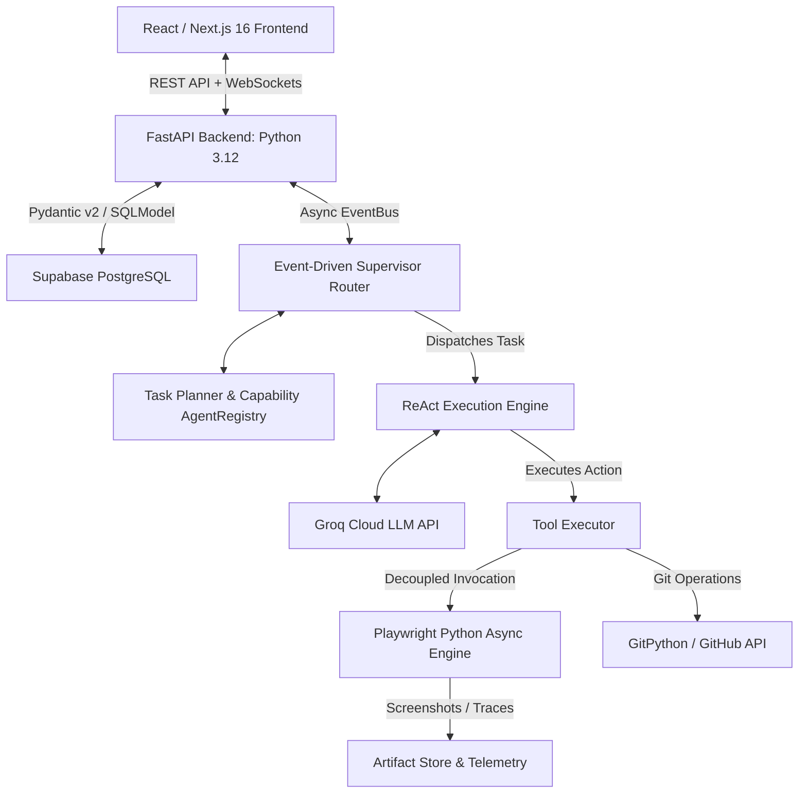

# How I Built and Productionalized TestPilot AI: An Interview Guide

This document is a deep-dive walkthrough of **TestPilot AI** written from my perspective as the creator. Use this script and structural guide to describe the project during system design and technical interviews.

---

## 1. The 60-Second Pitch (How I Introduce the Project)

> *"In my last project, I wanted to address a major bottleneck in the developer lifecycle: **E2E testing and test maintenance**. Traditional E2E tests are slow to write, painful to maintain, and flaky.
> 
> To solve this, I built **TestPilot AI**—an autonomous, AI-native QA platform. It scans repositories, parses the DOM, uses LLMs to generate robust Playwright test cases, runs them in isolated browser environments, and automatically heals broken selectors when UI changes break tests. 
> 
> I designed the application with a **Python FastAPI + Pydantic v2 Backend** and a **React / Next.js 16 Dashboard**. The agentic system uses an event-driven architecture with a single reusable ReAct engine, decoupled tool execution, heuristic-first login detection, capability-based agent registries, and fail-fast post-auth verification."*

---

## 2. The Architecture (Python FastAPI + React Next.js)

### Key Architectural Layers:
1. **Frontend**: React / Next.js 16 (App Router) styled with dark obsidian themes (`#070B14`), glassmorphic panels, and neon glowing borders.
2. **Backend**: FastAPI (Python 3.12) with Pydantic v2 schemas and native WebSockets for streaming agent logs.
3. **Core Agentic Architecture**:
   - **Single ReAct Engine (`ReActExecutor`)**: Reusable execution loop for all agent configurations.
   - **EventBus Abstraction**: Decouples message publishing from concrete transport mechanisms (Event, Redis Streams, NATS, Kafka).
   - **Decoupled Auth Subsystem (`AuthManager`)**: Includes `CredentialStore`, `AuthSessionCache`, `LoginDetector` (heuristic-first DOM scan with LLM fallback), and **Fail-Fast Post-Auth Verification** to prevent 50 duplicate failed screenshots on incorrect credentials.
   - **Capability-Based AgentRegistry**: Dynamically routes domain events to agent definitions based on event tags and priority.
   - **Decoupled Tool Registry & Executor**: `ToolRegistry` stores metadata; `ToolExecutor` executes Playwright Async and Git services.
   - **Dedicated Storage**: `ArtifactStore` handles screenshots/traces, `MemoryStore` stores DOM/failure history, and `TelemetryStore` records latency/token metrics.

---

## 3. Real-World Enterprise Productionalization

While FastAPI, Celery, and PostgreSQL are perfect for baseline deployments, an enterprise production environment scales with:

### 1. Ephemeral Serverless Worker Pools (AWS ECS / KEDA / Lambda)
*   Deploy **AWS ECS (Fargate)** or a **Kubernetes (EKS)** cluster using **KEDA (Kubernetes Event-driven Autoscaling)** to auto-scale Playwright Python workers dynamically from `0` to `500+` based on queue depth.

### 2. Centralized Persistent Object Storage (AWS S3 + CloudFront CDN)
*   Stream screenshots, videos, and Playwright traces directly to an **AWS S3 bucket** and serve them securely via **CloudFront CDN Pre-signed URLs** with short TTLs.

### 3. Connection Pooling & Secret Vaults
*   Use managed PostgreSQL with **PgBouncer** connection pooling.
*   Fetch API keys and credentials dynamically from **AWS Secrets Manager** or **HashiCorp Vault** via `CredentialStore`.

---

## 4. Potential Interviewer Cross-Questions & Answers

### Q1: "Why did you separate authentication into a dedicated `AuthManager` instead of letting the `BrowserExecutionAgent` authenticate?"
> **My Answer**: *"Placing authentication inside the Browser Execution Agent violates the Single Responsibility Principle. The Browser Execution Agent's only job is to execute Playwright test suites against a target URL.
> 
> By moving authentication into a dedicated `AuthManager`, we support session caching (`AuthSessionCache`), credential loading from Vault (`CredentialStore`), heuristic-first login detection (`LoginDetector`), and fail-fast post-authentication verification. The Browser Agent simply receives an active, validated `AuthSession` object."*

### Q2: "How does your Fail-Fast Post-Authentication Verification prevent cascade failures?"
> **My Answer**: *"Without post-authentication verification, an incorrect password causes Playwright to save a storage state of the login page itself. Subsequently, 50 E2E tests execute, all fail on navigation, and generate 50 duplicate screenshots of the login screen—wasting time, compute, and quota.
> 
> With Fail-Fast verification, right after applying credentials, `AuthManager` executes an assertion check on the target domain. If it detects the browser is still on `/login` or rendering `input[type="password"]`, it immediately aborts the run with a clear error: `'Authentication failed. Please verify the test credentials or login flow.'` This stops the execution cascade instantly."*

### Q3: "How do you avoid asking the LLM to make deterministic decisions?"
> **My Answer**: *"LLMs are expensive and non-deterministic. We keep non-ambiguous tasks—such as finding source files, executing Playwright suites, and collecting stack trace logs—in pure Python code using standard functions.
> 
> We invoke the LLM **only** for ambiguous decisions where reasoning is required, such as auto-healing broken locator selectors or deriving test scenarios from page layout structures."*
